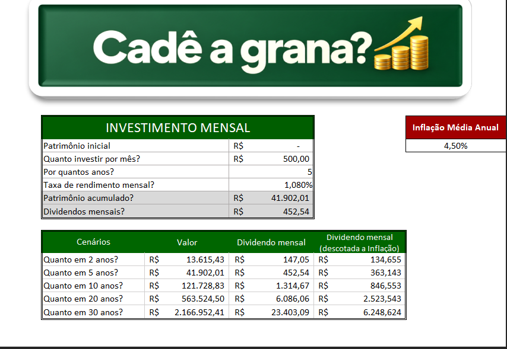

# 💰 Cadê a grana?

Planilha de Excel para simular a evolução de investimentos com patrimônio inicial, aportes mensais e juros compostos. Compare o patrimônio acumulado e o rendimento mensal estimado em diferentes prazos, incluindo o efeito da inflação sobre o poder de compra.

## Objetivo da planilha

Facilitar o planejamento financeiro por meio de simulações que mostram como o patrimônio inicial, os aportes mensais, a rentabilidade e o tempo influenciam o patrimônio acumulado e a renda mensal estimada.

A comparação entre prazos permite visualizar o efeito dos juros compostos e do reinvestimento dos rendimentos. A correção pela inflação ajuda a interpretar o poder de compra da renda projetada em reais de hoje.



## O que a planilha calcula

- Patrimônio acumulado no prazo escolhido.
- Rendimento mensal estimado sobre o patrimônio final.
- Cenários de 2, 5, 10, 20 e 30 anos.
- Poder de compra do rendimento mensal, descontando a inflação acumulada.

## Como usar

1. Baixe o arquivo da planilha disponível neste repositório e abra no Excel.
2. Preencha os campos de entrada:

   | Campo | O que informar |
   | --- | --- |
   | Patrimônio inicial | Valor já investido; use zero para começar do zero. |
   | Quanto investir por mês? | Valor do aporte mensal. |
   | Por quantos anos? | Prazo da simulação principal, em anos. |
   | Taxa de rendimento mensal? | Taxa mensal em percentual, por exemplo, `1,08%`. |
   | Inflação Média Anual | Inflação anual em percentual, por exemplo, `4,50%`. |

3. Consulte o patrimônio acumulado e os dividendos mensais estimados.
4. Compare os prazos na tabela de cenários.

Informe a rentabilidade **mensal** e a inflação **anual** nos respectivos campos. Preserve as fórmulas das células de resultado.

## Exemplo de simulação

Parâmetros usados na demonstração:

| Parâmetro | Valor |
| --- | ---: |
| Patrimônio inicial | R$ 0,00 |
| Aporte mensal | R$ 500,00 |
| Prazo principal | 5 anos |
| Rendimento mensal | 1,080% |
| Inflação anual | 4,50% |

Na simulação principal, o patrimônio chega a **R$ 41.902,01**, com rendimento mensal estimado de **R$ 452,54**.

| Prazo | Patrimônio acumulado | Dividendo mensal estimado | Dividendo mensal em reais de hoje |
| --- | ---: | ---: | ---: |
| 2 anos | R$ 13.615,43 | R$ 147,05 | R$ 134,66 |
| 5 anos | R$ 41.902,01 | R$ 452,54 | R$ 363,14 |
| 10 anos | R$ 121.728,83 | R$ 1.314,67 | R$ 846,55 |
| 20 anos | R$ 563.524,50 | R$ 6.086,06 | R$ 2.523,54 |
| 30 anos | R$ 2.166.952,41 | R$ 23.403,09 | R$ 6.248,62 |

Valores exibidos com duas casas decimais; os cálculos preservam a precisão antes do arredondamento.

## Como os cálculos funcionam

### Patrimônio acumulado

A projeção considera juros compostos e aportes ao final de cada mês:

```text
n = anos × 12

Patrimônio final =
    patrimônio inicial × (1 + taxa mensal)^n
    + aporte mensal × ((1 + taxa mensal)^n − 1) / taxa mensal
```

As taxas entram na conta em formato decimal: `1,08% = 0,0108`. Se a taxa for zero, o patrimônio final corresponde ao patrimônio inicial mais a soma dos aportes.

Na planilha, o patrimônio acumulado é calculado com a função VF do Excel em português. As células de entrada foram nomeadas para facilitar a leitura da fórmula:

```excel
=VF(rendimento_mensal;Anos*12;aporte_mensal*-1)+VF(rendimento_mensal;Anos*12;0;-patrimonio_inicial)
```

| Nome da célula | Informação |
| --- | --- |
| `patrimonio_inicial` | Valor investido no início da simulação |
| `aporte_mensal` | Valor investido ao final de cada mês |
| `Anos` | Prazo da simulação em anos |
| `rendimento_mensal` | Taxa de rendimento mensal em percentual |

A primeira função calcula o valor futuro dos aportes mensais; a segunda calcula o valor futuro do patrimônio inicial. As duas parcelas são somadas para obter o patrimônio total. O prazo é multiplicado por 12 para converter anos em meses.

Os aportes e o patrimônio inicial têm sinal negativo nos argumentos da função VF para que o resultado seja apresentado como valor positivo. Como o argumento de momento do pagamento foi omitido, os aportes são considerados ao final de cada mês.

A mesma conta também pode ser escrita em uma única função:

```excel
=VF(rendimento_mensal;Anos*12;-aporte_mensal;-patrimonio_inicial)
```

### Dividendos mensais

```text
Dividendo mensal estimado = patrimônio final × taxa mensal
```

Na planilha, “dividendos mensais” representa o rendimento mensal estimado usando a taxa informada sobre todo o patrimônio final. Esse cálculo não identifica pagamentos de dividendos de ativos específicos.

### Correção pela inflação

```text
Dividendo em reais de hoje =
    dividendo mensal estimado / (1 + inflação anual)^anos
```

A coluna **“Div. Mensal (desc. Inflação)”** mostra o poder de compra do rendimento futuro em valores de hoje. A inflação é acumulada de forma composta.

Por exemplo, com inflação constante de 4,5% ao ano, os R$ 23.403,09 mensais projetados para daqui a 30 anos equivalem ao poder de compra de aproximadamente R$ 6.248,62 hoje.

## Premissas da simulação

- Aportes realizados ao final de cada mês.
- Rendimentos reinvestidos durante o período de acumulação.
- Aportes mensais fixos, sem reajuste pela inflação.
- Rentabilidade mensal e inflação anual constantes.
- Sem saques durante a acumulação e sem desconto de impostos ou taxas.

Os resultados são projeções baseadas nos parâmetros informados, e não uma promessa de rentabilidade.

